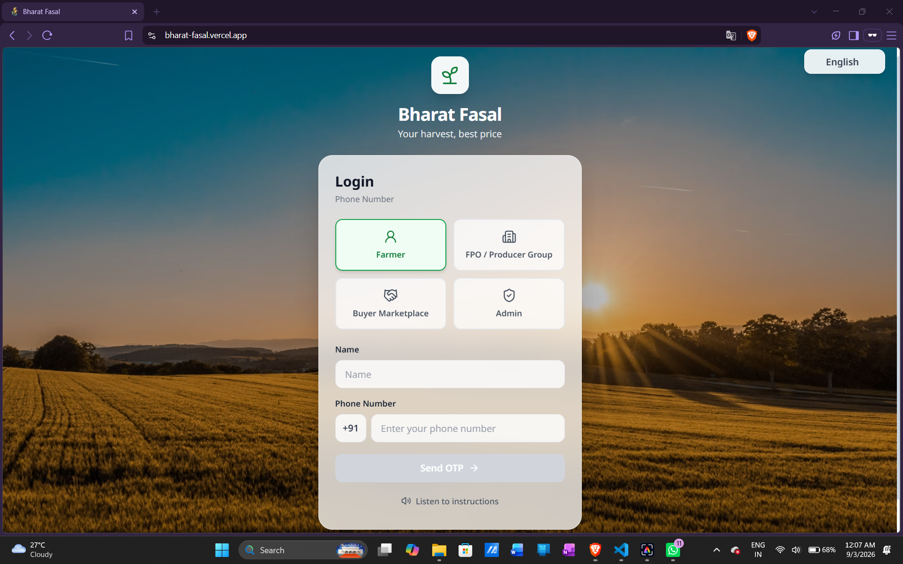
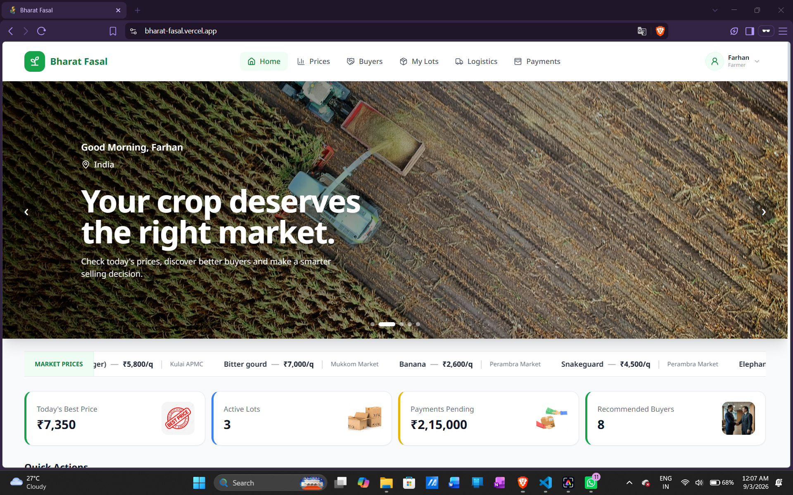
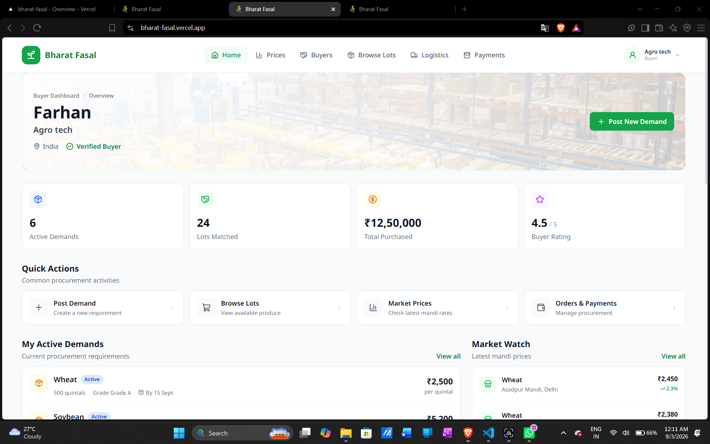
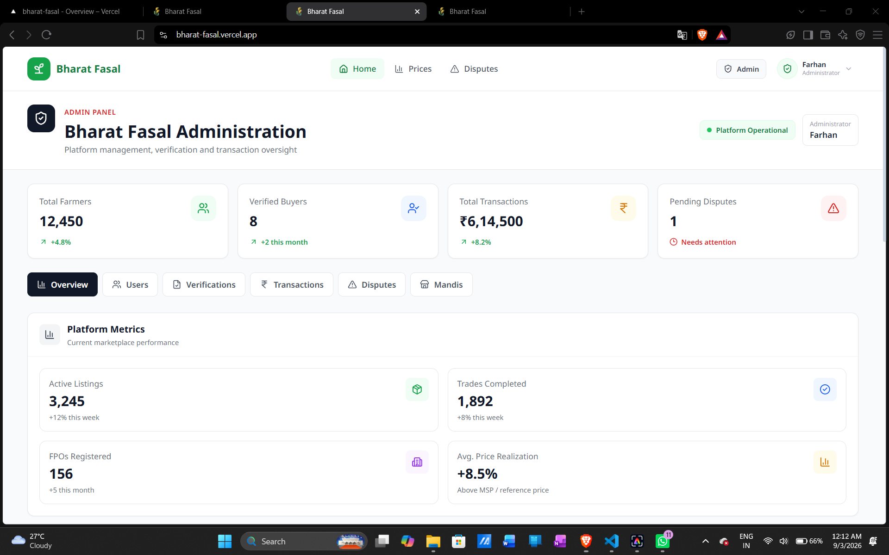

# 🌾 Bharat Fasal

### Transparent Agricultural Marketplace for Farmers, FPOs & Buyers

  <b>Connecting Farmers • Empowering Buyers • Building Transparent Agricultural Markets</b>

  
  
  
  
  

---

## 🖥️ Project Preview

  

<b>Login Dashboard</b>

  

<b>Farmer Dashboard</b>

  

<b>Buyer Dashboard</b>

  

<b>Admin Dashboard</b>

---

## 📌 About

**Bharat Fasal** is a digital agricultural marketplace connecting **farmers, FPOs, buyers, and agricultural stakeholders** through a structured procurement ecosystem.

It brings market prices, produce listings, buyer demands, matching, protected payment workflows, verification, transportation, delivery, and dispute management into one platform.

> **From market information to final settlement, Bharat Fasal aims to make agricultural procurement more transparent and manageable.**

---

## ❗ Problem

Farmers may face difficulties accessing:

- Current mandi prices
- Reliable buyers
- Market demand
- Quality requirements
- Transportation options
- Payment reliability

Buyers may struggle to:

- Find suitable produce
- Compare prices
- Aggregate required quantities
- Verify quality and sellers
- Manage transportation and delivery

This creates a gap between **agricultural supply and demand**.

---

## 💡 Solution

Bharat Fasal provides a unified marketplace where:

- 👨‍🌾 **Farmers** can list produce and find buyers
- 🌾 **FPOs** can aggregate produce and manage procurement
- 🏢 **Buyers** can create demands and discover suitable lots
- 🛡️ **Admins** can manage verification, transactions, and disputes

---

## 🚀 Key Features

- 📊 **Government Mandi Prices** — Market price information through Government Open Data / AGMARKNET
- 🌾 **Agricultural Lots** — List crop, quantity, quality, price, location, and availability
- 🏢 **Buyer Demands** — Define crop, quantity, quality, price, location, and deadline
- 🤝 **Supply-Demand Matching** — Match lots with buyer requirements
- 💳 **Protected Payment Workflow** — Payment linked with verification and delivery milestones
- 🔍 **Quality & Quantity Verification** — Support for inspection and delivery evidence
- 🚚 **Transportation Management** — Buyer or seller can arrange transportation
- 📦 **Delivery Tracking** — Track the procurement journey
- ⚖️ **Dispute Management** — Handle quality, quantity, payment, transport, and delivery issues
- 🌐 **Multi-language Interface**
- 📱 **Responsive Design**
- 👥 **Role-Based Dashboards**

---

## 🔄 How It Works

    Farmer / FPO
         ↓
    Create Lot
         ↓
    Buyer Creates Demand
         ↓
    Matching
         ↓
    Purchase
         ↓
    Payment Secured
         ↓
    Quality & Quantity Verification
         ↓
    Transportation
         ↓
    Delivery
         ↓
    Buyer Inspection
         ↓
    Payment Release

---

## 🛠️ Tech Stack

| Technology | Purpose |
|------------|---------|
| React.js | Frontend |
| Vite | Build Tool |
| Tailwind CSS | Styling |
| React Router | Routing |
| Lucide React | Icons |
| i18next | Internationalization |
| Node.js | Backend Runtime |
| Express.js | Backend API |
| CORS | API Communication |
| dotenv | Environment Variables |
| LocalStorage | Prototype Persistence |
| Government Open Data / AGMARKNET | Mandi Prices |

---

## 📊 Government Mandi API

Bharat Fasal uses the **Government of India's Open Data / AGMARKNET** source for mandi market information.

The backend exposes:

`GET /api/mandi-prices`

The API provides information such as:

- Commodity
- Market
- State
- District
- Minimum Price
- Maximum Price
- Modal Price
- Arrival Date

The backend also uses temporary caching to reduce unnecessary API requests.

---

## ⚙️ Setup

### 1. Clone Repository

    git clone https://github.com/fsid908/bharat-fasal.git

### 2. Open Project

    cd bharat-fasal

### 3. Install Dependencies

    npm install

### 4. Configure Environment Variables

Create `.env`:

    DATA_GOV_API_KEY=your_data_gov_api_key

### 5. Start Backend

    node server/index.js

Backend:

    http://localhost:5000

### 6. Start Frontend

Open another terminal:

    npm run dev

Frontend:

    http://localhost:3000

---

## 🧪 Prototype Scope

Bharat Fasal is currently a **functional prototype / MVP demonstration**.

### Implemented

- Responsive React frontend
- Role-based dashboards
- Farmer, FPO, Buyer and Admin workflows
- Government mandi API integration
- Backend API with caching
- Agricultural marketplace
- Buyer demand workflow
- Procurement workflow
- Payment workflow
- Logistics workflow
- Dispute workflow
- Multi-language interface
- LocalStorage-based persistence

### Current Limitations

Some production services are currently represented through prototype workflows.

- OTP authentication is prototype-level
- Protected payment is a simulated workflow
- Several features use LocalStorage/mock data
- Real-time GPS tracking requires external integrations
- Production verification requires identity/business verification services

---

## 🚀 Future Scope

The platform can be extended with:

- 🔐 Real OTP & secure authentication
- 🗄️ Production database
- 👤 KYC & business verification
- 💳 Real payment & settlement infrastructure
- 🚚 Real-time GPS logistics
- 📸 Digital quality verification
- 🤖 AI-based price prediction
- 📈 Demand forecasting
- 🛡️ Fraud & risk detection
- 📊 Advanced analytics

---

## 💎 Innovation & USP

Bharat Fasal goes beyond simply connecting farmers and buyers.

It connects the complete procurement lifecycle:

**Market Information → Supply Discovery → Demand → Matching → Purchase → Protected Payment → Verification → Transportation → Delivery → Inspection → Settlement**

> **Bharat Fasal doesn't just connect farmers with buyers — it aims to make the complete agricultural transaction more transparent, secure, and manageable.**

---

## 👥 Team Bharat Fasal

- **Farhan Siddiqui**
- **Farhan Nur**
- **Abuzer**
- **Alfiya**
- **Alina**
- **Anas**

### GitHub Profile

**Profile:**  
https://github.com/fsid908

### Bharat Fasal Repository

**Repository:**  
https://github.com/fsid908/bharat-fasal

---

## 📜 License

Bharat Fasal is currently developed as an **academic / prototype project** for educational, demonstration, and innovation purposes.

---

  <b>🌾 Bharat Fasal</b>

  Connecting Farmers • Empowering Buyers • Building Transparent Agricultural Markets

  <b>Built with ❤️ by Team Bharat Fasal</b>

